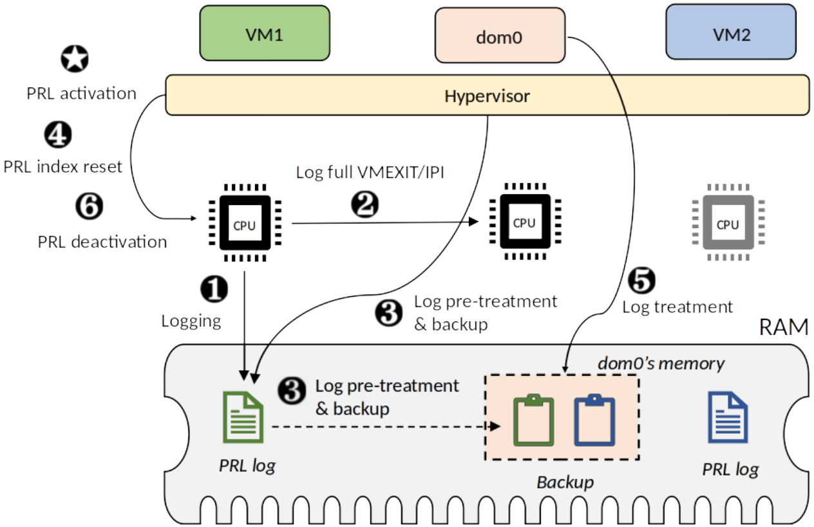

# Page Reference Logging (PRL)

Intel page modification logging (PML) is a hardware feature introduced in 2015 for tracking modified  memory pages of virtual machines (VMs). Although initially designed to improve VMs checkpointing and live migration, we present in this paper how we can take advantage of this virtualization technology to efficiently estimate the working set size (WSS) of a VM.
To this end, we first conduct a study of PML with the Xen hypervisor to investigate its performance  impact on VMs and the accuracy of a WSS estimation system that relies on the current version of PML. Our three main findings are as follows. (1) PML reduces by up to 10.18% the time of both VM live migration and checkpointing. (2) PML slightly reduces the negative impact of live migration on application performance by up to 0.95%. (3) A WSS estimation system based on the current version of PML provides inaccurate results. Moreover, our experiments show that write-intensive applications are negatively impacted, with up to 34.9% of performance degradation, when using PML to estimate the WSS of a VM that runs these applications.

Based on the aforementioned findings, we introduce page reference logging (PRL), an extended version of PML that allows both read and write memory accesses to be tracked without impacting user VMs, thus more suitable for WSS estimation. We propose a WSS estimation system that leverages PRL and show how it can be used in a data center exploiting memory overcommitment. We implement PRL and the underlying WSS estimation system under Gem5, a popular open-source computer architecture simulator. Evaluation results validate the accuracy of the WSS estimation system and show that PRL does not incur more performance degradation on user’s VMs.

The following figure illustrates the PRL functioning.

<!--  -->

All graphs of the work can be found in the [figures](figures) folder, and [here](results-scripts/accuracy/) are some scripts to generate them.
