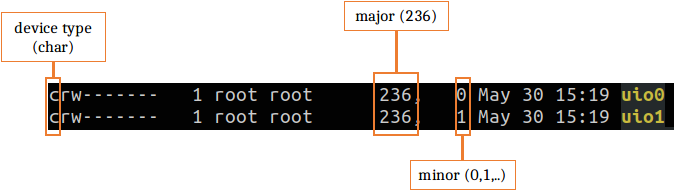

# OoH: Out of Hypervisor

[](https://zenodo.org/badge/latestdoi/475580986)

Out of Hypervisor (OoH) is a new virtualization research axis. Instead of emulating full virtual hardware inside a VM to support a hypervisor, the OoH principle is to individually expose current hypervisor-oriented hardware virtualization features to the guest OS. This way, guest’s processes could also take benefit from those features. We illustrate OoH with Intel PML (Page modification Logging), a feature that allows efficient dirty page tracking to improve VM live migration. Because dirty page tracking is at the heart of many essential tasks including process checkpointing (e.g., CRIU) and concurrent garbage collection (e.g, Boehm GC), OoH exposes PML to accelerate these tasks in the guest. We present two OoH solutions namely Shadow PML (SPML) and
Extended PML (EPML) that we integrated into CRIU and Boehm GC. Evaluation results showed that EPML speeds up CRIU checkpointing by about `13x` and Boehm garbage collection by up to 6× compared to SPML, /proc, and userfaultfd while reducing the impact of monitoring applications by about `16x`.

OoH is implemented using Xen 4.10.0 hypervisor, Linux 4.15.0 guest OS, and BOCHS 2.6.11 Intel x86 emulator (only for EPML, which extends the hardware), Boehm Garbage Collector and CRIU.

This repo provides tools and guidelines for testing SPML and EPML implementations.

# Overview

We present two solutions of OoH, namely Shadow PML (noted SPML) and Extended PML (noted EPML). SPML requires no hardware modification, while EPML slightly extends the hardware for better performance. The following figure presents the architecture of the two solutions. In the guest, we provide OoH as a userspace I/O (UIO) driver composed of a kernel module (OoH Module) and a userspace library (OoH Lib). At load time, the former does a set of initialization operations, including ring buffer (RB) allocation that is shared with userspace (and the hypervisor in SMPL only). Tracker uses OoH Lib to register the PID of Tracked with OoH Module. From there on, the processor can log dirty pages’ addresses to a 512KB PML buffer, which is copied to RB once full. Relying on OoH Lib, Tracker can periodically fetch the collected addresses to achieve its goal (e.g., checkpointing). EPML differs from SPML in two ways: (1) With EPML, the processor also logs GVAs, thus avoiding costly reverse mapping in OhH Lib; (2) With EPML, the guest kernel can directly deal with the processor, thus avoiding costly hypercalls. 


# Shadow PML (SPML)

To facilitate the tests, the following material is provided (and should be downloaded):
> Most of the ressources are stored on [Amazon S3](https://s3.console.aws.amazon.com/s3/buckets/artifacteval?region=us-east-2&tab=objects#). You should sign in as an **IAM** user, with the following information: 
> 
> Account ID: **581028953800** 
> 
> User Name: **Artifact-Evaluators**
> 
> Password: **ArtifactSC22**

- Xen 4.10 patched
- Linux 4.15 patched and compiled. We rather provide the compiled version (with the vmlinuz image) since the compilation can take some time (usually more than an hour). 
<!--- The user can however find the patch [here](linux-OoH/patch). -->
- The use case [Boehm GC](https://github.com/ivmai/bdwgc) already patched, and datasets for its applications.
- A VM image with Linux patched and the Xen tools (for PML activation from the guest) installed.

## Environment Setup

### Prerequisites
1. Operating System: `Ubuntu 18.04`

2. CPU Brand: `Intel` 

2. Support for PML feature: 
    * `sudo modprobe msr`
    * `sudo rdmsr 0x48BH` : if PML is supported, the bit at position **49** will be set (convert the `rdmsr` output from hexa to binary).
    > If you issue a `rdmsr : command not found`, then install `msr-tools`(`sudo apt install msr-tools`)

3. Dependencies for Xen, ssh, and nfs:
   ```
   sudo apt update
   sudo apt build-dep xen
   sudo apt install libc6-dev libglib2.0-dev libyajl-dev yajl-tools libbz2-dev bison flex zlib1g-dev git-core debhelper debconf-utils debootstrap fakeroot gcc make binutils  liblz-dev  python-dev libncurses-dev libcurl4-openssl-dev libx11-dev uuid-dev libaio-dev pkg-config bridge-utils udev bison flex gettext bin86 bcc iasl gcc-multilib libperl-dev libgtk2.0-dev
   sudo apt install openssh-server openssh-client
   sudo apt install nfs-common nfs-kernel-server
   ```
4. Sources: Download:
   * [Linux](https://s3.console.aws.amazon.com/s3/object/artifacteval?region=us-east-2&prefix=linux-OoH.zip) and the [zip file](https://github.com/bstellaceleste/Artifact-Eval/archive/refs/heads/SPML.zip) of the repo (containing Xen and Boehm) and uncompress them into **/mnt/tmp**. It is important that the root directory of your tests is **/mnt/tmp** because it is the path used to compile Linux and to write all the scripts and, since it is independent of the user's `$HOME` environment it allows easier portability and deployment.
   * The [VM image](https://s3.console.aws.amazon.com/s3/object/artifacteval?region=us-east-2&prefix=vm.raw) into `/mnt/tmp/OoH`.
   * The [datasets](https://s3.console.aws.amazon.com/s3/object/artifacteval?region=us-east-2&prefix=datasets.zip) for the Phoenix applications.
   
### Xen Installation
> All commands in sudo (_compilation and installation might take a while_)
> Note: You must have an internet connexion as Xen will download some tools during the `make` phase
```
cd /mnt/tmp/xen-OoH
./configure
make -j
make -j install
ldconfig
update-grub
```
After this, reboot on Xen (select in the grub `Ubuntu with Xen hypervisor`).
To start the Xen deamon, type the following command: `sudo /etc/init.d/xencommons start`.
To verify, you can check either for the Xen info `sudo xl info` or the list of VMs `sudo xl li`.

### VM Creation
A configuration [file](vm.cfg) is provided to create a VM using `sudo xl create vm.cfg`. You must see `ooh` if you check for the list of VMs (`sudo xl li`).

To access the VM, you need to create and configure a bridge:
```
sudo brctl addbr xenbr0
sudo ifconfig xenbr0 10.0.0.1
```
To provide the VM with network access to the Internet, use the [routing](routing.sh) script in the repo. If your network interface is `ethX` for example, then use the script this way: `sudo ./routing.sh ethX`.

## Testing

### Accessing the VM
When the VM has completely booted (its state is `b` -for _blocked_ i.e., waiting or sleeping- in the list), you can access it via ssh: `ssh stella@10.0.0.2`. The password is `toto`.

The VM boots by default on the modified kernel, and in the `$HOME` directory there is a config script that automatically mounts the linux-OoH and the Boehm directories respectively to `/mnt/tmp/linux-4.15-rc7` and `$HOME/boehm` inside the VM.

### Compiling Boehm GC
Boehm is compiled in the VM (from `$HOME`) as follows:
```
cd boehm
sudo ./configure --disable-threads --prefix=/home/stella/boehm/Use_Case_Apps/phoenix-2.0 --enable-static --enable-checksums --enable-mmap --disable-munmap --disable-shared
sudo make
sudo make install
```
Libraries are installed to the `lib` dir.
Once installed, export GC-specific environment variables to enable incremental collection and statistics prints:
```
GC_ENABLE_INCREMENTAL='GC_ENABLE_INCREMENTAL'
GC_PRINT_VERBOSE_STATS='GC_PRINT_VERBOSE_STATS'
GC_USE_GETWRITEWATCH='GC_USE_GETWRITEWATCH'
export GC_ENABLE_INCREMENTAL
export GC_PRINT_VERBOSE_STATS
export GC_USE_GETWRITEWATCH
```
> Note: These variables should be exported at each reboot, otherwise defined in an env file.

### Testing Boehm GC with [Phoenix](https://github.com/kozyraki/phoenix) Applications
Now that our environment is set and the GC that integrates SPML is compiled, we can test it using the Phoenix benchmark suite.

**1. Load the OoH kernel module**

The first thing is to load the OoH kernel module:

`su (password: toto)`
> :warning: You should log in as superuser :warning:do not use `sudo` but `su`:warning:
```
cd /mnt/tmp/linux-4.15-rc7/vtf-uio_vS0
make
insmod uio_vtf.ko
```
If the module has been successfully loaded, you must find in `/dev` a device named **`uio0`**.

**2. Compile Phoenix applications**

From the `boehm` directory:
```
cd Use_Case_Apps/phoenix-2.0/
sudo make
```

**3. Run applications**

All applications are in the `boehm/Use_Case_Apps/phoenix-2.0/tests` dir, and the datasets required may have been previously downloaded in the **_Prerequisites_** Section.

Now, leave the VM a moment and go back to your host in the `/mnt/tmp/OoH-SPML` dir to uncompress dataset.zip in each corresponding application dir:
```
unzip -d . datasets
unzip -d boehm-OoH/Use_Case_Apps/phoenix-2.0/tests/histogram/ datasets/dataset_hist
unzip -d boehm-OoH/Use_Case_Apps/phoenix-2.0/tests/string_match/ datasets/dataset_string
unzip -d boehm-OoH/Use_Case_Apps/phoenix-2.0/tests/word_count/ datasets/dataset_word
```
Now that all datasets have been uncompressed, you can go back to the VM and run the tests:

> From /home/stella/boehm/Use_Case_Apps/phoenix-2.0 and in superuser mode `su (password: toto)`

   * histogram
     ```
     cd tests/histogram
     ./histogram dataset/large.bmp
     ```
   * kmeans
     ```
     cd tests/kmeans
     ./kmeans -d 5000 -c 5000 -p 5000 -s 100
     ```
   * pca
     ```
     cd tests/pca
     ./pca -r 10000 -c 5000 -s 200
     ```
   * string_match
     ```
     cd tests/string_match
     ./string_match dataset/key_file_200MB.txt
     ```
   * word_count
     ```
     cd tests/word_count
     ./word_count dataset/word_100MB.txt
     ```

### Comparison With `/proc`

`/proc` is the default technique implemented in Boehm. To perform tests with the latter:
   * edit the file `boehm/include/private/gcconfig.h`
   * comment the following lines like this:
   ```
   //#       ifndef PML_VDB
   //#         define PML_VDB
   //#       endif
   ```
   * recompile boehm as previously explained and re-execute the applications from 3.).

# Security

To avoid side-channel that may be caused by tracked processes leveraging the ring buffer to interfere information on other processes, you can dedicate a per-process ring buffer and restrict its access to tracker processes only.

## Per-Process Ring Buffer
This is only necessary when many trackers are running simultaneously.
Otherwise, the second tracker can be launched once the first has terminated and removed the device.

If 2 trackers however need to execute at the same time, you can can achieved per-processs ring buffer by creating another `/dev/uioX` device to be used by the following tracker process.
When you first launch the uio_vtf module it creates the first uio device, in /dev named, **`/dev/uio0`**.
To create the second one:
1. Upadte `uio_vtf.c` (in /mnt/tmp/linux-4.15-rc7/vtf-uio_vS0) like this:
   ```
   sed -i 's/uio_vtf_device/uio_vtf_device2/g' uio_vtf.c
   sed -i 's/uio_vtf_driver/uio_vtf_driver2/g' uio_vtf.c
   ```
2. Create a new file for this new device:
   `cp uio_vtf.c uio_vtf2.c`
3. Update the Makefile
   `sed -i 's/uio_vtf.o/uio_vtf.o uio_vtf2.o/g' Makefile`
4. Recompile and insert the new device: `make && insmod uio_vtf2.ko`
5. Check /dev/ (`ls /dev`): you should now see **uio1**

Once this is done, you now need to update the tools for updating the uio device path -`UIO_DEVICE`- (add another one) which is currently statically filled in `xen-OoH/tools_VM/libxc/xc_domain.c`. And then recompile the tools: `cd xen-OoH/tools_VM/` and `sudo make && sudo make install`.

## Ring Buffer Access Restriction
We rely on Linux-`cgroups` to restrict access to /dev/uioX devices only to tracker processes.

### Creating a New cgroup
1. Install dependencies
   `sudo apt update && sudo apt install cgroup-tools libcgroup1`
2. Copy files to /etc
   `sudo cp /usr/share/doc/cgroup-tools/examples/cgconfig.conf /etc/ && sudo cp /usr/share/doc/cgroup-tools/examples/cgred.conf /etc/`
3. Edit /etc/cgconfig.conf
   ```
   group untrusted_uio {
       devices {
   #       Deny access to /dev/uioX
           devices.deny="c 236:* mrw";
       }
   }

   group trusted_uio0 {
       devices {
   #       Allow access to /dev/uio0
           devices.allow="c 236:0 mrw";
       }
   }
   ```
   > The device number for `uio` is availale in the ls output: `ll /dev/uio0`
   > 

4. Load configs
   `sudo cgconfigparser -l /etc/cgconfig.conf && sudo cgrulesengd`
   
### Set Applications Permissions
Now that the process control groups are created, the VM proprietary should launch all applications in the `untrusted_uio` cgroup:
`cgexec -g devices:untrusted_uio tracked` where `tracked` is the command line for the application to run.
This way, none of *tracked* can access any /dev/uioX. They will get a `permission denied` error.

Only the tracker can now be granted with access to /dev/uio devices:
`cgexec -g devices:trusted_uio0 tracker`.

> You can add in /etc/cgconfig.conf as many groups trusted_uioX as uio devices for each tracker.

# Extended PML (EPML)

The use of EPML is a bit more tricky since it should be emulated.

We use to this end the [Bochs](https://sourceforge.net/projects/bochs/files/bochs/2.6.11/) emulator.

You have a [bochs](bochs) folder in the downloaded repo. In the installation [procedure](bochs/README.md) you will find how to emulate an launch a host using Bochs.

Once the emulated host is launched, you can install Xen and create a virtual machine exactely as in the **SPML** Section, and follow the above guidelines to repeat the experiments.
